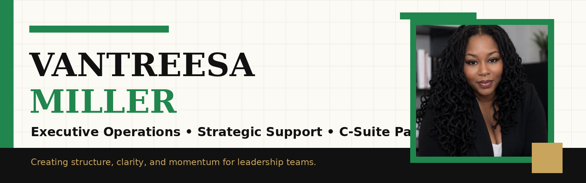

  

  
  
  
  

---

## Executive Operations • Strategic Support • Executive Assistant

I help senior leaders create clarity, structure, and momentum across complex priorities.

I am an Executive Assistant and Executive Operations professional with 15+ years of experience supporting senior leadership in high-growth and mission-driven organizations.

---

## Current Focus

- Executive Operations
- Strategic Business Support
- Leadership Enablement
- Process Improvement
- Client Experience
- AI-Powered Administrative Workflows

---

## Featured Portfolio

### Executive Operations Portfolio

A polished portfolio website showcasing my executive support experience, operations background, technical tools, and leadership-facing strengths.

**Visit:** https://vantreesamiller.github.io

---

## Featured Systems

| Executive Command Center | Meeting Follow-Up System | Event Operations Playbook |
|---|---|---|
| Priority tracking, client touchpoints, travel, deadlines, and next steps | Agendas, action items, owners, decisions, and follow-up communication | Vendor sourcing, budgets, timelines, logistics, and event execution |

---

## Quick Links

- 🌐 Portfolio: https://vantreesamiller.github.io
- 🔗 LinkedIn: https://www.linkedin.com/in/vantreesa-m-6804ba166/
- 📄 Resume: https://vantreesamiller.github.io/Vantreesa-Miller-Resume.pdf
- 📧 Email: vantreesamiller@gmail.com
